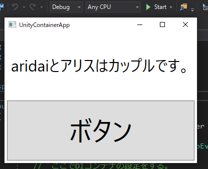

# UnityContainerApp
Unityを使ったDIコンテナのサンプルアプリです。

# やっていること

DIコンテナの **Unity** を使って、次のように "彼女" (`Girlfriend`) が切り替わるWPFアプリケーションになっています。

* Releaseビルド: 魔理沙が彼女になる。
* Debugビルド: アリスが彼女になる。
* テスト: アリスが彼女になる。

また、**MVVM** パターンを適用した際のインタラクション (イベント処理やVMからVへの操作) のサンプルにもなっています。  
さらに、[**ReactiveProperty**](https://github.com/runceel/ReactiveProperty) や [**Rx**](https://github.com/dotnet/reactive) の機能も一部使っています。  
(無理やり使おうとした感じだけれども。)

アプリケーションを実行すると次のようになります。

Releaseビルドのとき:


Debugビルドのとき:



ボタンを押したとき:


クラス図はこんな感じです。


## ポイント

### 依存性の登録について
次のような感じで抽象型と具象型 (とは限らないけども) を紐付けるなどといったことができます。

```CSharp
//  DIコンテナを生成する。
var container = new UnityContainer();

//  MarisaをGirlfriendの実装として登録する。
container.RegisterType<Girlfriend, Marisa>();

//  登録したGirlfriend (実体はMarisa) を取得する。
var girlfriend = container.Resolve<Girlfriend>();

```

他にも、具体的なインスタンスを紐付けたり、ファクトリメソッドを紐付けたりできたりします。  
詳しくは [`App.xaml.cs`](https://github.com/aridai/UnityContainerApp/blob/master/UnityContainerApp/App.xaml.cs) を見ればわかると思います。

### ViewModelLocatorについて
Prismの機能で `p:ViewModelLocator.AutoWireViewModel="True"` をViewに設定すると、自動的に命名規則に基づいてViewModelをセットしてくれます。

今回の場合は `MainWindow` に `MainWindowViewModel` が紐付けられるのですが、このViewModelには引数なしコンストラクタがありません。  
(フィールドインジェクションをしているので。)  
ですから、DIコンテナによって依存性を解決させて、それを `ViewModelLocator` に使ってもらうという登録操作をする必要があります。  
それが次のコードです。

```CSharp
ViewModelLocationProvider.SetDefaultViewModelFactory(type => this.container.Resolve(type));
```

コードを見ると、DIコンテナに `MainWindowViewModel` を手動では登録していませんが、既に登録された依存関係を利用して解決ができるのであれば、勝手に依存関係を解決してインスタンスを生成してくれるみたいです。

### 属性について
フィールド・プロパティインジェクションするものには `Dependency` 属性を、コンストラクタインジェクションをするコンストラクタには `InjectionConstructor` をつけています。

詳しくは [APIドキュメント](https://unitycontainer.github.io/api/index.html) にて `Attribute` でフィルター検索をしてみてください。

### Prismの機能の再開発について
私のコードを見ると、Prismで既に提供されているはずの `InteractionRequestTrigger` と `PopupWindowAction` が再開発されています。  
これは、Prismでサポートしているのが `System.Windows.Interactivity` の方のアセンブリであって、**XamlBehaviorsWpf** パッケージの `Microsoft.Xaml.Behaviors` の方のアセンブリではないからです。  
[こんなプルリク](https://github.com/PrismLibrary/Prism/pull/1644) を見つけたのですが、**DO-NOT-MERGE-!!! 🛑** をというラベルが貼られて閉じられています。

ただし、実装はオープンで見れるようになっているので、そのまんま再開発したわけです。  
なお、Prism本家のコードでは `Obsolete` 属性が付けられていますが、今回は `IDialogService` を使うほどでもないと思ったので、こっちを使うことにしました。

## 使用ライブラリ

* Unity  
  (https://github.com/unitycontainer/unity)

* Prism.Wpf / Prism.Unity  
  (https://github.com/PrismLibrary/Prism)

* Microsoft.Xaml.Behaviors.Wpf  
  (https://github.com/Microsoft/XamlBehaviorsWpf)

* ReactiveProperty  
  (https://github.com/runceel/ReactiveProperty)

* System.Reactive  
  (https://github.com/dotnet/reactive)
